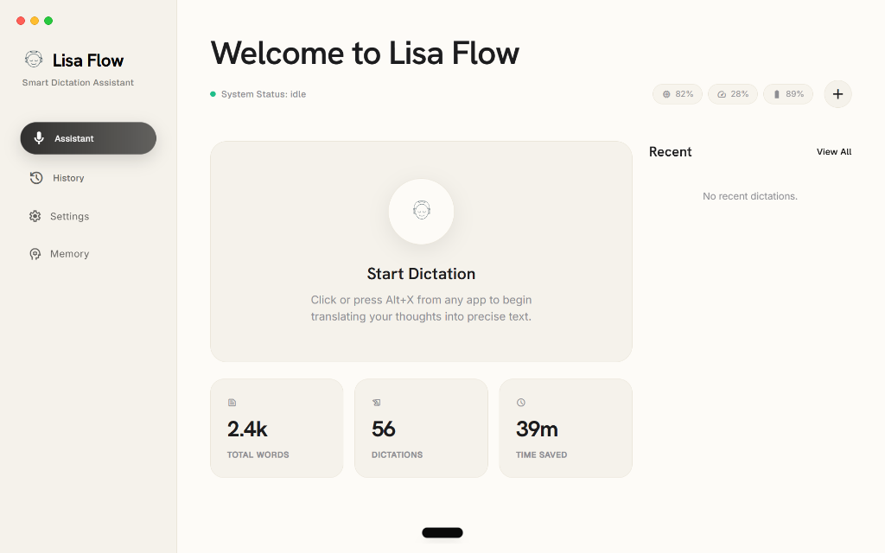

<div align="center">
  
  <h1>Lisa Flow</h1>
  <p><strong>A blazingly fast voice dictation assistant that actually gets you.</strong></p>
  
  [](https://v2.tauri.app/)
  [](https://reactjs.org/)
  [](https://fastapi.tiangolo.com/)
  [](https://www.python.org/)
  [](#)
</div>

<br>
<div align="center">
  
  &nbsp;&nbsp;
  
</div>

---

> ⚠️ **Note:** Lisa Flow is currently a **Windows-only** application. A macOS port is entirely possible, but currently unsupported due to Windows-specific window tracking (`pygetwindow`) and build scripts.

I built Lisa Flow because I was tired of standard voice-to-text engines missing the context of what I was trying to say. Worse, since I frequently speak in "Tanglish" (a mix of Tamil and English), standard tools would just spit out phonetic gibberish.

Lisa runs quietly in the background of your OS. You press a hotkey from any app, start talking, and she instantly types the perfectly polished, grammatically correct version of what you *meant* to say straight into your active window.

## What makes it different?

- **It actually pastes for you:** Press `Alt+X`, talk, and wait a second. Lisa simulates keyboard inputs to type the result exactly where your cursor is (VS Code, Chrome, Word, anywhere). No copy-pasting required.
- **Understands Tanglish:** Since it uses Google's Gemini models under the hood, it easily untangles mixed-language phonetic speech into proper English.
- **It remembers things:** There's a silent background agent constantly analyzing your dictations. If you casually mention "I'm working on a React project" or "My boss is Sarah", Lisa saves that to her long-term memory. Over time, she stops making silly spelling mistakes about your life because she actually knows your context.
- **Text Polishing:** Didn't want to speak? Just highlight a messy paragraph you typed out and press `Ctrl+Shift+X`. She'll instantly rewrite it.
- **Glassmorphism UI:** I wanted something that looked native and beautiful, so it's built with a completely transparent, frameless Tauri window that feels incredibly premium.

## How it works (The Tech Stack)

Lisa is split into two parts so it can run as a standalone desktop app:
1. **The Frontend (Tauri v2 + React + Vite + Tailwind):** This handles the settings dashboard and a tiny floating "Island" UI that records your voice and plays subtle audio chimes.
2. **The Backend (Python + FastAPI):** This runs silently as a sidecar process. It handles all the heavy lifting: talking to the Gemini API, maintaining the background memory loop, tracking your CPU/RAM stats, and hooking into the OS to inject keyboard strokes (via PyAutoGUI).

## Running it yourself

### What you'll need
- Node.js (v18+)
- Python (v3.10+)
- Rust (for Tauri)
- C++ Build Tools (if you're on Windows)

### 1. Clone it
```bash
git clone https://github.com/karthik26-hub-lab/lisa-os.git
cd lisa-os
```

### 2. Boot up the Python engine
```bash
cd backend
python -m venv venv
.\venv\Scripts\activate
pip install -r requirements.txt
python main.py
```

### 3. Spin up the Tauri app
In a new terminal window:
```bash
cd frontend
npm install
npm run tauri dev
```

### 4. Compiling a standalone `.exe`
If you just want one double-clickable `.exe` file that starts everything up automatically:
```bash
# From the root folder
.\build.bat
```
You'll find your brand new executable sitting in `frontend/src-tauri/target/release/`.

> **Note:** The first time you launch the app, open the Settings tab and drop in your Google Gemini API key. Everything is stored locally on your machine, so your key is perfectly safe.
